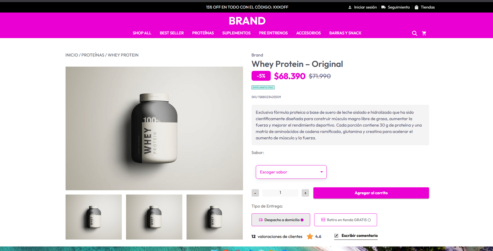
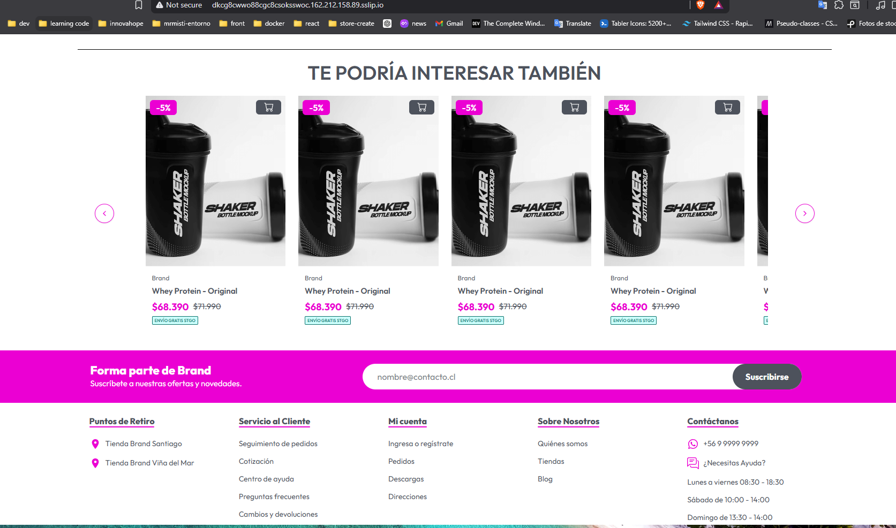
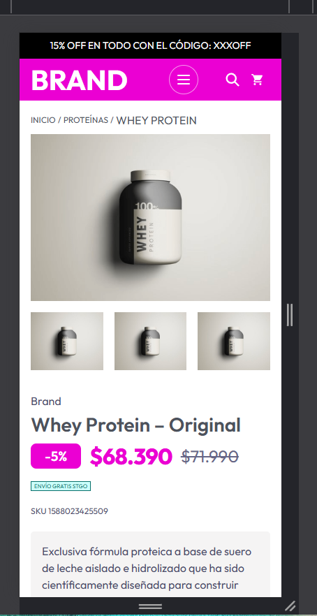
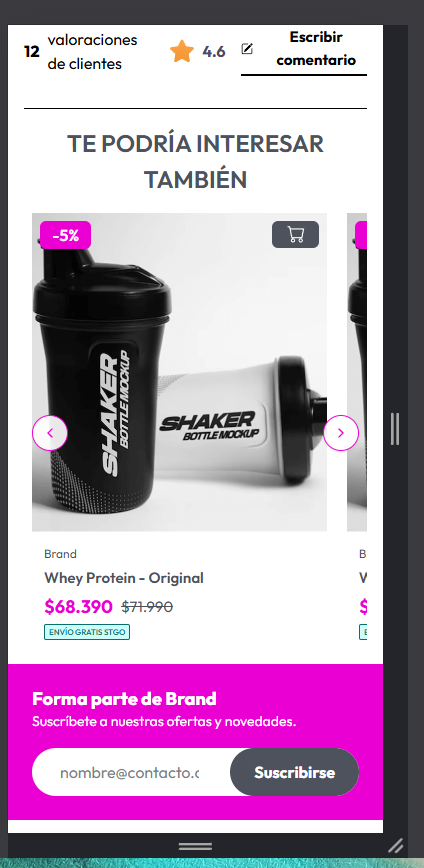

# 🧪 Product Detail – Technical Test

Este proyecto fue desarrollado como parte de una **prueba técnica frontend**, con el objetivo de demostrar habilidades en **arquitectura modular**, **componentización**, **consumo de APIs**, y **buenas prácticas de desarrollo en React + TypeScript**.

---

## 🚀 Tecnologías utilizadas

| Tecnología               | Propósito                                |
| ------------------------ | ---------------------------------------- |
| ⚡ **Vite + React**      | Entorno de desarrollo moderno y veloz    |
| 🟦 **TypeScript**        | Tipado estático y mantenibilidad         |
| 🎨 **Tailwind CSS**      | Estilado utilitario y responsive         |
| 🧩 **Material UI (MUI)** | Componentes accesibles y personalizables |

---

## 🧱 Estructura del proyecto

```bash
src/
├─ assets/               # Imágenes y recursos estáticos
├─ components/           # Componentes UI globales
├─ features/             # Módulos por dominio
│  └─ product/
│     ├─ components/     # Componentes específicos (gallery, header, etc.)
│     ├─ hooks/          # Hooks personalizados (useFlavours, etc.)
│     ├─ pages/          # Páginas del módulo
│     ├─ services/       # Consumo de API + mapeo de datos
│     └─ types/          # Definiciones de tipos e interfaces
├─ layouts/              # Estructuras visuales (landing, nav, footer)
├─ theme/                # Configuración de colores, fuentes, estilos globales
└─ utils/                # Funciones auxiliares y helpers
```

## 💾 Instalación y ejecución

# 1️⃣ Instalar dependencias

pnpm install

# 2️⃣ Crear archivo de entorno

echo "VITE_API_URL=https://preapi.aquaforce.cl/api" > .env

# 3️⃣ Ejecutar el entorno de desarrollo

pnpm dev

## 📸 Capturas del Proyecto

### 💻 Versión Desktop – Detalle del Producto

Vista general del producto con galería, selector de sabor y productos relacionados.



---

### 🖼️ Galería con Swiper (Vista Desktop)

Componente interactivo de galería implementado con Swiper.js y diseño responsivo.



---

### 📱 Versión Mobile – Diseño Responsivo

Interfaz adaptada para pantallas pequeñas. Se mantienen jerarquías, márgenes y legibilidad.

## 

---

### 🖼️ Galería con Swiper (Vista Mobile)


